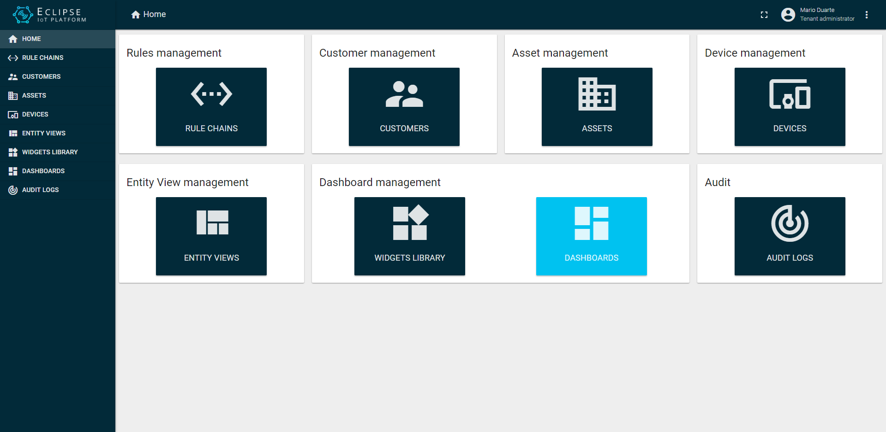

# Eclipse - ThingsBoard Custmized UI

asd

## Screenshots
[**Home screenshot**](./src/assets/artwork/home.png)

## Running Thingsboard UI

Collect and Visualize your IoT data in minutes by following this [guide](https://thingsboard.io/docs/getting-started-guides/helloworld/).

## ThingsBoard

ThingsBoard is an open-source IoT platform for data collection, processing, visualization, and device management.

## Documentation

ThingsBoard documentation is hosted on [thingsboard.io](https://thingsboard.io/docs).

## Getting Started with Thingsboard

Collect and Visualize your IoT data in minutes by following this [guide](https://thingsboard.io/docs/getting-started-guides/helloworld/).

## Support

 - [Community chat](https://gitter.im/thingsboard/chat)
 - [Q&A forum](https://groups.google.com/forum/#!forum/thingsboard)
 - [Stackoverflow](http://stackoverflow.com/questions/tagged/thingsboard)

## Licenses

This project is released under [Apache 2.0 License](./LICENSE).
